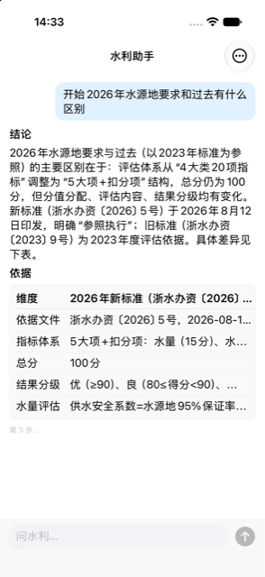
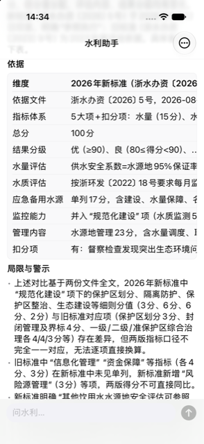
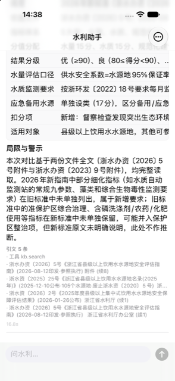

<p align="center"></p>
# 水利助手 · hydro-deck

**水利问题问一句，十几秒拿到带引文的答案。**

    

自建领域 agent 的手机端：流式打字机、步骤与工具进度实时可见、答案带引文，七种终态如实显示——包括「有保留」和「拒答」。业务零本地逻辑，后端加能力不用动 app。

<table><tr>
<td align="center" width="25%"><br><sub>问一句「2026 年水源地要求和过去有什么区别」——结论先行，依据表随后</sub></td>
<td align="center" width="25%"><br><sub>答案自带「局限与警示」：两版指标口径不能逐项换算这种话，它主动说</sub></td>
<td align="center" width="25%"><br><sub>线上真对话：新旧标准对比 + 局限警示 + 引文 5 条，16.8 秒</sub></td>
</tr></table>

## 它做什么

| | |
|---|---|
| **SSE 流式，步骤看得见** | 答案打字机式流出，检索/比对的步骤进度实时可见——十几秒的等待里你知道它在干什么，不是对着转圈猜。 |
| **答案带引文，也带局限** | 每个结论下面是依据表和引文清单；口径对不上、无法逐项换算这类局限，它写在答案里而不是等你踩坑。七种终态如实显示——包括「有保留」和「拒答」。 |
| **业务零本地逻辑** | 所有智能在后端 agent，app 是薄壳。后端加一种能力、改一版提示词，手机端一行不用动——这正是薄壳的全部意义。 |

## 怎么拿到

TestFlight 内测中（2026-09-02 首发）；后端私有，不开放试用。

薄壳，全部智能在私有后端 `hydro-agent.tianli.cyou`（访问闸后）。代码可读可编，没有后端账号跑不出对话。

## 构建

```bash
brew install xcodegen
xcodegen generate
xcodebuild -scheme HydroDeck -destination 'generic/platform=iOS Simulator' build
```

- 仓里的 `*.sh` 是作者本机舰队脚本的 shim（三平台构建 / 真机装机 / TestFlight），依赖 `~/Dev` 下的总部工具，不在本仓；没有那套工具时它们会明确退出。
- `Shared/PlatformCompat.swift` 是总部共享文件的逐字节副本（iOS-only SwiftUI 修饰符在 macOS 侧的同名 no-op），别在这里改它。

开发细节（回归、验证通道、约束）见 [DEVELOPING.md](DEVELOPING.md)。

## 相关

- 产品页：<https://apps.tianli.cyou/p/hydro-deck-ios.html>
- 舰队总览（10 个 app 怎么来的）：<https://apps.tianli.cyou/ios.html>
- 教程：[从零到 TestFlight：一个人做 iPhone app 的完整路径](https://blog-ai.tianli.cyou/nine-ios-apps-in-two-weeks)

## License

MIT © 2026 曾田力 (Tianli Zeng)
