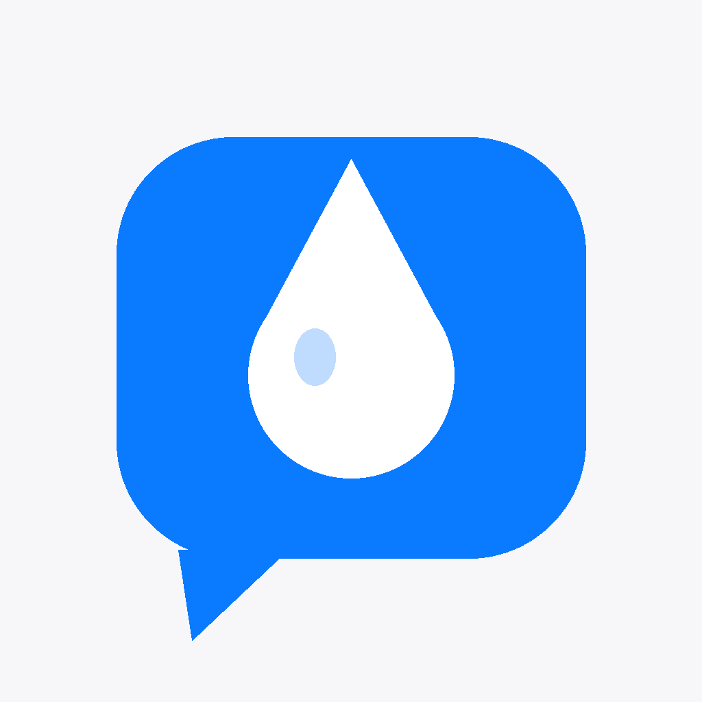
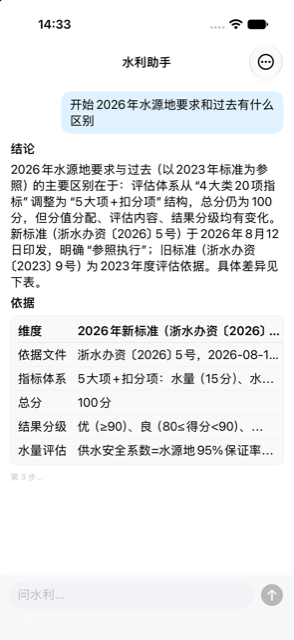
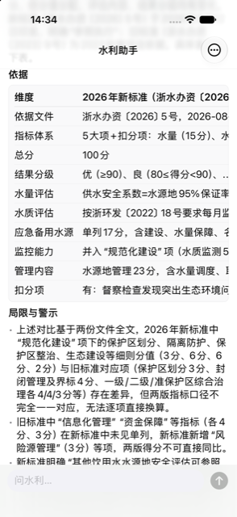
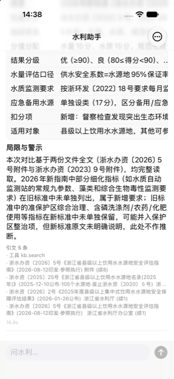

[中文](README.md) | **English**

<p align="center"></p>

# Water Assistant · hydro-deck


**Ask a water-engineering question and receive a cited answer in a little over ten seconds.**

    

The mobile client for a self-hosted domain agent: streaming text, live step and tool progress, cited answers, and honest display of seven final states, including qualified answers and refusals. No business logic runs locally; backend capabilities can grow without changing the app.

<table><tr>
<td align="center" width="25%"><br><sub>Ask how 2026 water-source requirements differ from earlier ones: conclusion first, evidence table next</sub></td>
<td align="center" width="25%"><br><sub>Answers include limitations and warnings, proactively stating when indicators from two editions cannot be converted item by item</sub></td>
<td align="center" width="25%"><br><sub>A real online conversation: old/new standards comparison, limitations, and 5 citations in 16.8 seconds</sub></td>
</tr></table>

## What it does

| Feature | Description |
|---|---|
| **SSE streaming with visible steps** | Answers stream like a typewriter while retrieval and comparison progress appears live. During the ten-plus-second wait, you can see what it is doing instead of guessing at a spinner. |
| **Answers include citations and limitations** | Conclusions are followed by evidence tables and citation lists. Incompatible measurement conventions or inability to convert indicators item by item are stated in the answer. Seven final states are displayed honestly, including qualified answers and refusals. |
| **No local business logic** | All intelligence lives in the backend agent; the app is a thin shell. Adding a backend capability or revising a prompt requires no mobile-code changes, which is the purpose of the shell. |

## Availability

In private TestFlight testing (first released 2026-09-02); the backend is private and no trial is available.

A thin shell with all intelligence in the private backend `hydro-agent.tianli.cyou`, behind access control. The code can be read and built, but conversations require a backend account.

## Build

```bash
brew install xcodegen
xcodegen generate
xcodebuild -scheme HydroDeck -destination 'generic/platform=iOS Simulator' build
```

- The repository's `*.sh` files are shims for the author's local fleet scripts (three-platform builds / device installation / TestFlight). They depend on HQ tools under `~/Dev` that are not in this repository; without them, the scripts exit explicitly.
- `Shared/PlatformCompat.swift` is a byte-for-byte copy of a shared HQ file (iOS-only SwiftUI modifiers become same-named no-ops on macOS). Do not edit it here.

See [DEVELOPING.md](DEVELOPING.md) for development details, including regression checks, validation channels, and constraints.

## Related

- Product page: <https://apps.tianli.cyou/p/hydro-deck-ios.html>
- Fleet overview (how the 10 apps came about): <https://apps.tianli.cyou/ios.html>
- Tutorial: [From zero to TestFlight: the complete path to building iPhone apps solo](https://blog-ai.tianli.cyou/nine-ios-apps-in-two-weeks)

## License

MIT © 2026 Tianli Zeng

<!-- lightweight:start -->
## Resource use

Download size is App Store data; memory, CPU and launch time are iOS Simulator measurements, not physical-device figures.

| Download | Idle memory | Idle CPU | Simulator cold launch to first screen ready |
|---|---|---|---|
| **0.3 MB** (installed 0.8 MB) | **28.3 MB** | **0%** | **1.5 s** |

Sizes are read back for this exact distribution build. The physical device is not yet measured, so memory, CPU and launch time come from the iOS Simulator and are labelled as such.

<sub>v0.1 (1) · iPhone 17（iPhone18,3）；体积为 Apple 设备切片记录，运行性能尚未真机实测 · TestFlight VALID（未上架）; package sizes exclude user data and caches; installed phone version not verified · measured 2026-09-26. Sizes come from Apple App Store Connect device slices for this build. Memory, CPU and launch time were measured on iPhone 17 Pro / iOS 27.0 Simulator / Mac16,12 / Apple M4 / macOS 27.2 with a local Release build v0.1 (1) (2026-09-26), App process only; these are not physical-device figures, which are still unmeasured. Memory uses phys_footprint; CPU is CPU time ÷ wall time over a 60-second sampling window; sizes in decimal MB. Raw data: [perf/lightweight.json](perf/lightweight.json).</sub>
<!-- lightweight:end -->
